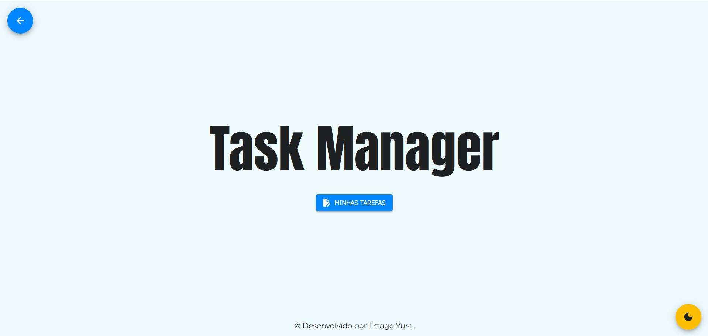
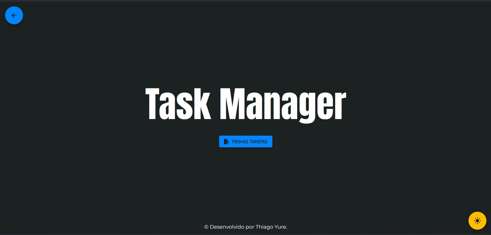
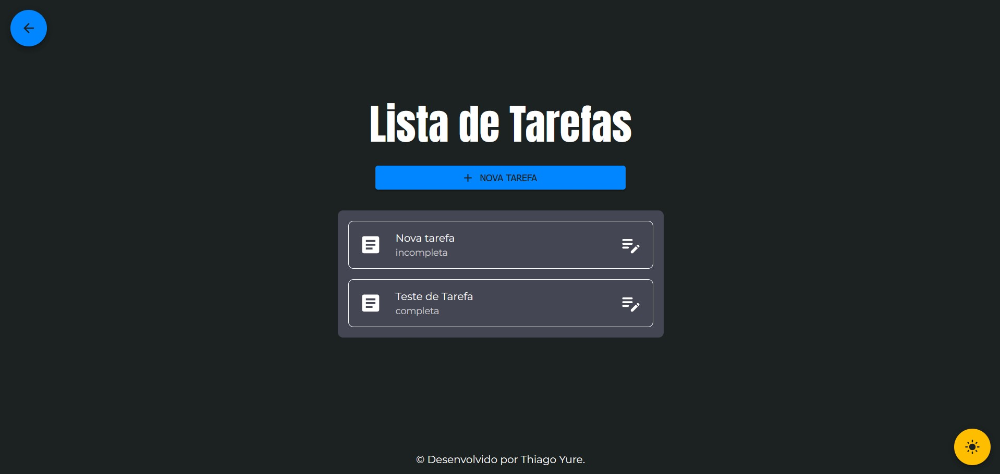
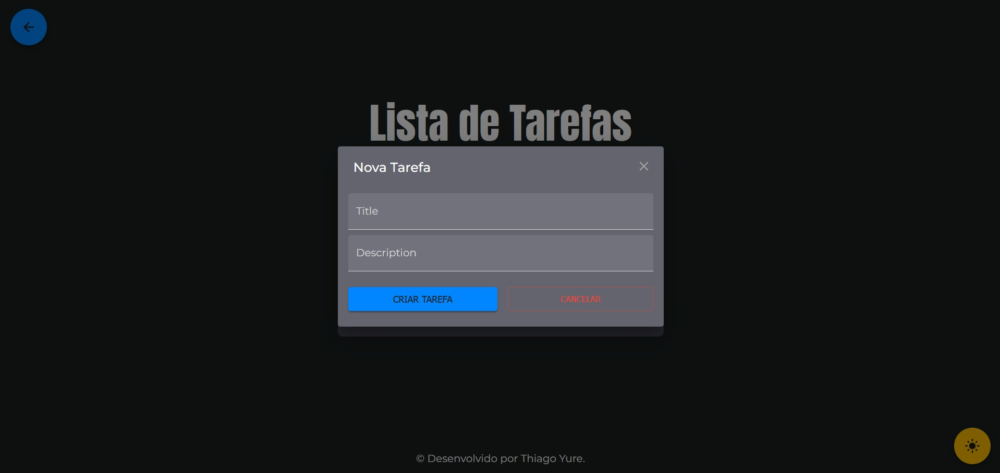

# 📝 Task Manager Fullstack
 
Um projeto fullstack utilizando NestJS no backend e Next.js no frontend, com tema claro/escuro e CRUD completo de tarefas.

---

## 🚀 Demonstração






🔗 [Acesse o frontend (Vercel)](https://task-manager-front.vercel.app)  
🔗 [Acesse a API (Railway)](https://task-manager-fullstack-production-e830.up.railway.app/)

---

## ⚙️ Tecnologias

### Frontend
- [Next.js](https://nextjs.org/)
- [Material UI](https://mui.com/)
- TypeScript

### Backend
- [NestJS](https://nestjs.com/)
- [Mongoose](https://mongoosejs.com/)
- MongoDB (Railway)
- Typescript

---

## 🧩 Funcionalidades

- CRUD completo de tarefas (Criar, Listar, Editar, Deletar)
- Tema escuro e claro com toggle dinâmico
- Interface responsiva e moderna

---

## 📁 Estrutura do Projeto

```
task-manager-fullstack/
├── backend/         # NestJS API
│   ├── src/
│   └── ...
├── frontend/         # Next.js + MUI
│   ├── app/
│   ├── components/
│   ├── context/
│   ├── public/
│   └── ...
```

---

## 🛠️ Instalação Local

### 1. Clone o repositório
```bash
git clone https://github.com/ThiagoYure/task-manager-fullstack.git
cd task-manager-fullstack
```

### 2. Configure o backend (NestJS)
```bash
cd backend
# Crie um arquivo .env e preencha com suas variáveis, como DATABASE_LINK e SERVER_PORT
npm install
npm run start
```

### 3. Configure o frontend (Next.js)
```bash
cd ../frontend
npm install
npm run dev
```

---

## 🧪 Variáveis de Ambiente

### Backend (`.env`)
```
DATABASE_LINK=seu_mongodb
SERVER_PORT=3000
```

---

## 📤 Deploy

- Frontend: [Vercel](https://vercel.com)
- Backend: [Railway](https://railway.app)

---
## 👨‍💻 Autor

**Thiago Yure**  
[GitHub](https://github.com/ThiagoYure)  
[LinkedIn](https://www.linkedin.com/in/thiagoyure)

---

> Projeto desenvolvido com fins de aprendizado e demonstração de stack fullstack moderna com NestJS + Next.js.
